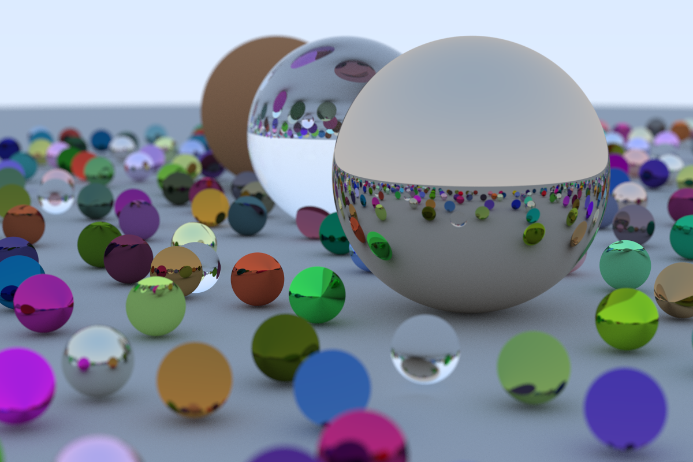

# Ray Tracing in One Weekend 

[](https://github.com/zarak/ray-tracing-one-weekend/actions/workflows/ray-tracing.yaml)

This repository is based on the book [_Ray Tracing in One Weekend_](https://raytracing.github.io/books/RayTracingInOneWeekend.html) by Peter Shirley. The code is my own implementation in Haskell, whereas the book uses C++.



### Commands
```
$ cabal run ray-tracing-one-weekend -- --help

Usage: ray-tracing-one-weekend [--imageWidth INT] [--samplesPerPixel INT]

  Ray tracer

Available options:
  --imageWidth INT         Set the image width
  --samplesPerPixel INT    Set the samples per pixel
  -h,--help                Show this help text
```
